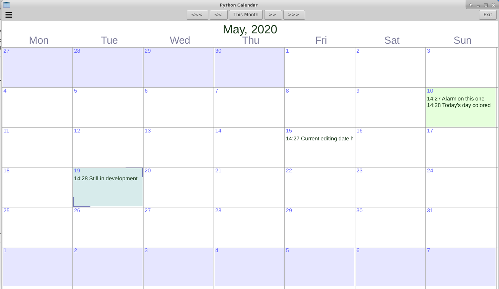

# pycal

## Calendar with monitorable alarm QUEUE and the usual features

In (under) development. Most of it works ....

INSTALL

# Usual gi installs plus:

sudo apt-get install gir1.2-notify-0.7

# EOF

