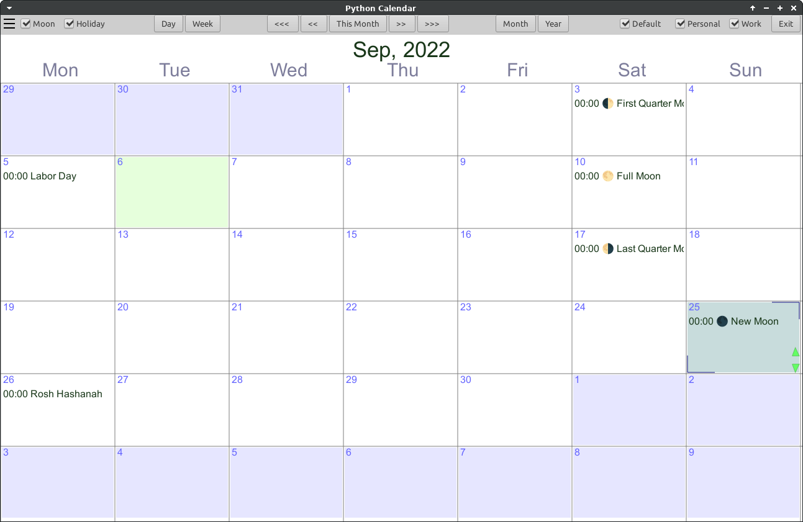

# Python Calendar - pycal

## Calendar with alarm queue monitor ability ... and the usual features

In (under) development. Most of it works ....

Nice basis for any python calendar related project

## INSTALL

### Usual gi installs plus:

sudo apt-get install gir1.2-notify-0.7

# EOF

