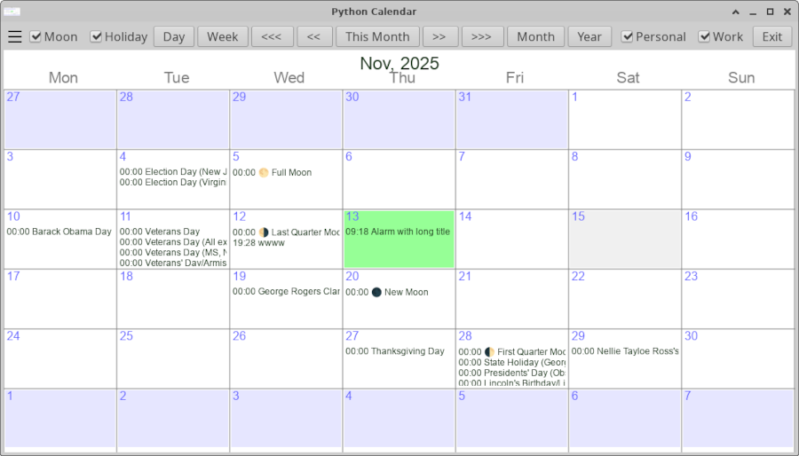
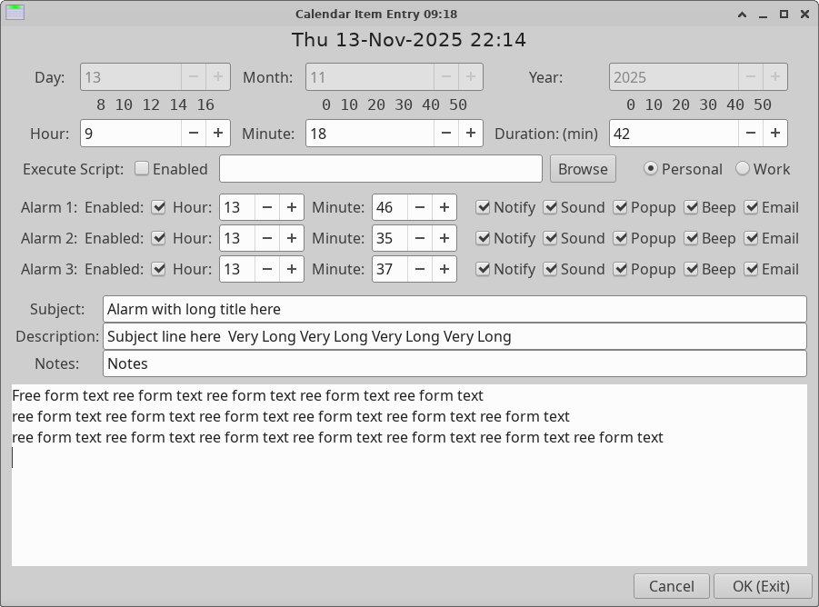

# Python Calendar - pyvcalgui

## Monthly calendar with alarms

... Plus command line queue monitor

Nice basis for any python calendar related project

## Features

    * Three alarms per entry
    * Hot keys for frequent operations
    * Configurable Notify / Popup / Sound / Command Exe

## Main Calendar Screen:

## Data Entry Screen:

## Installation:

### Usual gi install plus:

    sudo apt-get install gir1.2-notify-0.7

Also:

    pip install pyvcal

Calendar data in ~/.pycal/caldata.sql

Most of it works .... still needs some TLC

// # EOF

